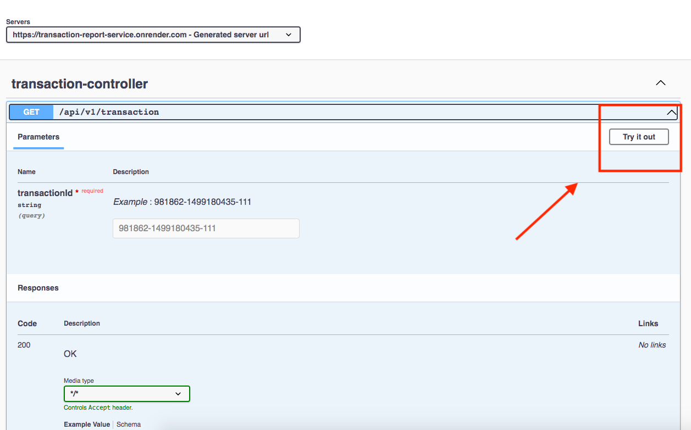
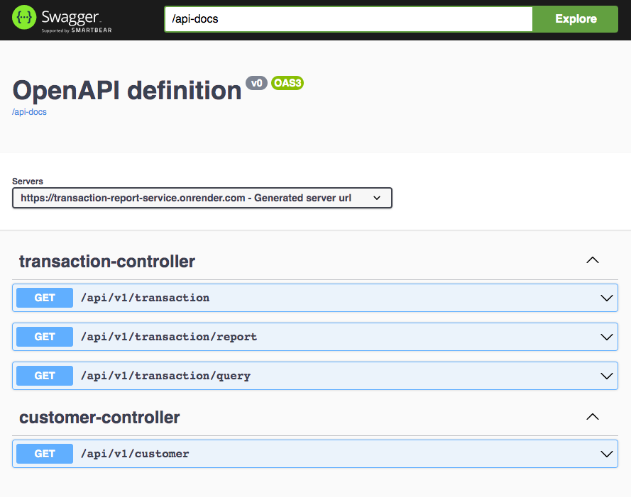

# Transaction Report Service

**The Transaction Report Service** consumes the PSP client API and delivers transaction reports.

Try out the API live using Swagger dashboard;  

🚀 **Live URL : https://transaction-report-service.onrender.com/swagger-ui/index.html**

## Tech Stack

- Java21 
- SpringBoot 3.1.5
- Open API
- MapStruct

## About PSP Client API
- The Transaction Report Service consumes the PSP client API and delivers transaction reports.
- Following authorization to the PSP API, an access token is generated and remains valid for 10 minutes.
-The **Transaction Report Service** caches this token for **9 minutes and 45 seconds** (with a 15-second buffer to avoid using a stale token) and automatically adds it as an authorization header to each request for the PSP API through an interceptor.

## Run/Testing the Application
- You can try out the API live using Swagger. Live URL : https://transaction-report-service.onrender.com/swagger-ui/index.html
- **No manual login/authentication is required**. In the absence of a token, interceptors will automatically set it during
  the call.
- The token will be cached for a duration of 9 minutes and 45 seconds. Upon expiration, it will be evicted, and a new
  token will be provided.
- **Local test:** Access Swagger UI to test the API after running the project at http://localhost:8080/swagger-ui/index.html
- Please find api-contract.yml [here](src/main/resources/api-contract.yml)

### Endpoints

 
## TODO

- Add FeignClient decoder/deserializer for variousTransactionQueryResponse types.
- api-key for secure service-to-service communication
- Improve field types. and some fields still have underscores; remove the underscores.
- Fail test scenarios.

