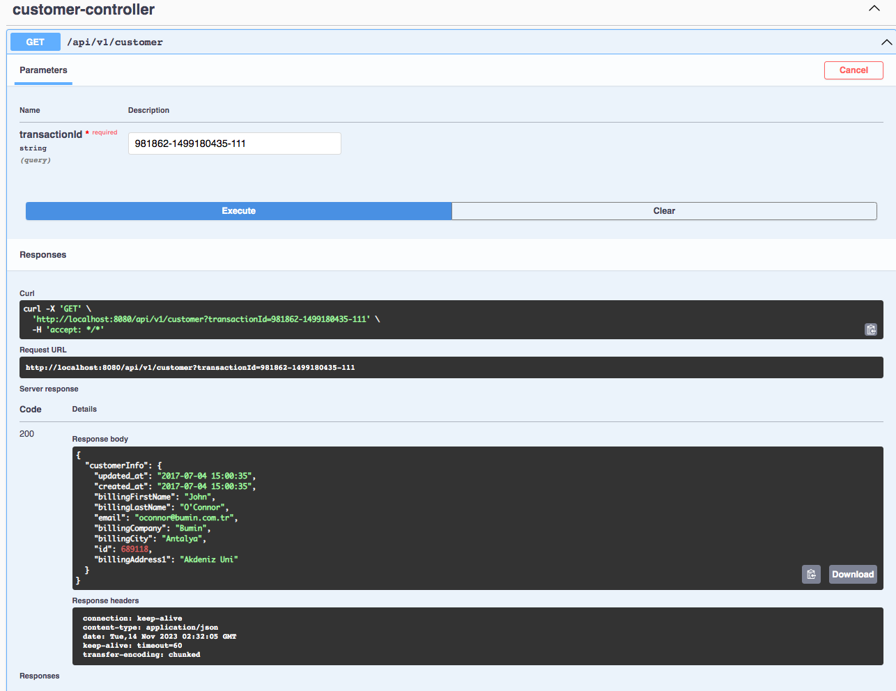

# Transaction Report Service

## Tech Stack

- Java21 
- SpringBoot 3.1.5
- Open API
- MapStruct

## About PSP Client API

- The PSP Client API token remains valid for a duration of 10 minutes.
- This token is cached for **9 minutes and 45 seconds** (15 sec buffer to avoid a staled token), and it is automatically
  added as an authorization header to each request through an interceptor.

## Run/Testing the Application

- **No manual login/authentication is required**. In the absence of a token, interceptors will automatically set it during
  the call.
  The token will be cached for a duration of 9 minutes and 45 seconds. Upon expiration, it will be evicted, and a new
  token will be provided.
- Access swagger ui to test api after run project. http://localhost:8080/swagger-ui/index.html
- Please find api-contract.yml [here](src/main/resources/api-contract.yml)

  

**Test Data**

| Key           | Value                 |
|---------------|-----------------------|
| transactionId | 981862-1499180435-111 |
| fromDate      | 2016-01-01            |
| toDate        | 2023-11-13            |

   

### Overall

### Get Transaction

### Transaction Report

### Transaction Query

### Get Customer Details

## TODO

- api-key for secure service-to-service communication
- Fail test scenarios.
- Remove underscore from response dtos.

